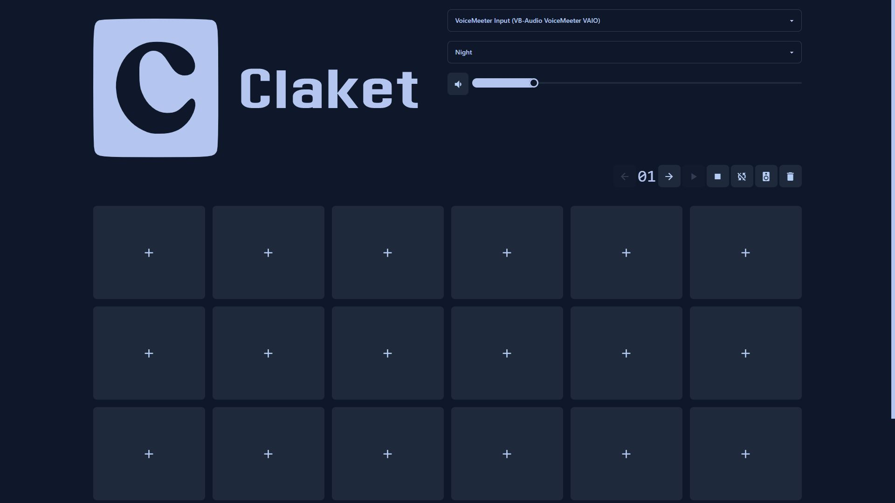
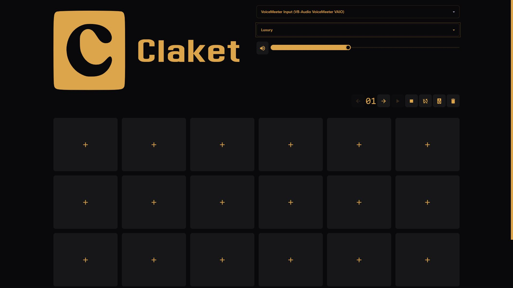
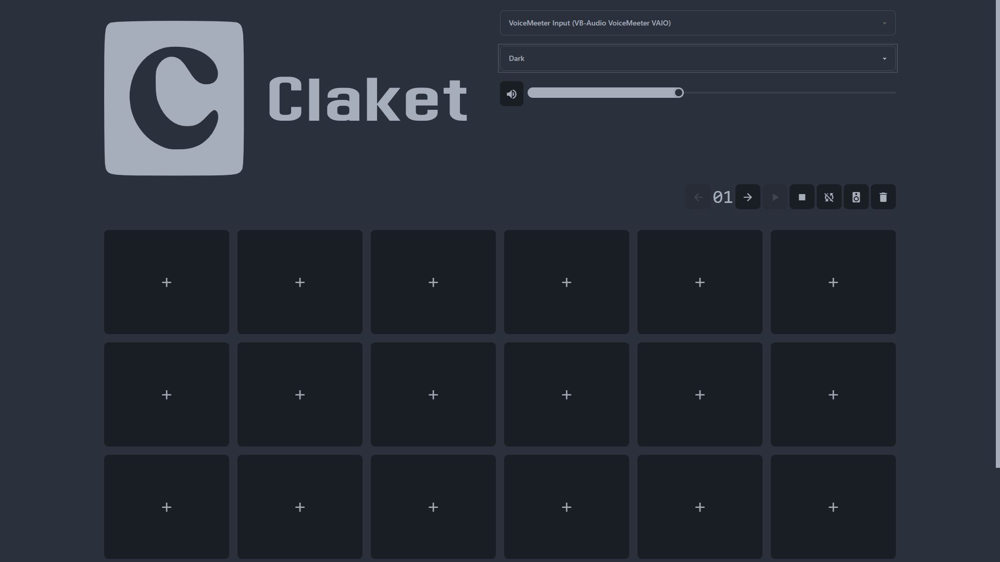

<br/>
<p align="center">
  <a href="https://github.com/aera128/aera128/claket">
    
  </a>

  <h3 align="center">Claket Soundboard</h3>

  <p align="center">
    Soundboard made with Nuxt2. Play sounds in voice chats !
    <br/>
    <br/>
    <a href="https://github.com/aera128/aera128/claket/issues">Report Bug</a>
    .
    <a href="https://github.com/aera128/aera128/claket/issues">Request Feature</a>
  </p>
</p>


## About The Project

Claket is a web PWA that allows you to play sounds in voice chats, made with Nuxt2 and using the IndexedDB API.

## Features
- [x] Load file (.mp3, .wav, .flac and video file too) in button
- [x] Drag & drop file in button
- [x] Play, pause, resume and stop sounds (You can play multiple sound at the same time)
- [x] Master volume and specific volume of each sound
- [x] Choose audio output
- [x] Keyboard navigation (Arrows, Spacebar, WASD, ZQSD, M, R, L, P, +, -)
- [x] Multi pages
- [x] Loop audio
- [x] Playback sound on default audio output
- [x] Delete all sounds of a page
## Getting Started

### 🚧 Installation

Go the [releases](https://github.com/aera128/claket/releases/) page

- Windows : use the [setup](https://github.com/aera128/claket/releases/download/neutralino/claket-setup.exe) or extract the zip file and launch claket-win_x64.exe
- Other : extract the zip file and launch the executable corresponding to the architecture of your machine

### Or
### 🌐 Web app
- You can use claket on [https://claket.netlify.app](https://claket.netlify.app) (Audio output choice not available on firefox, use a chromium or edge based browser)

## Local Dev Installation

```bash
# install dependencies
$ yarn install

# serve with hot reload at localhost:3000
$ yarn dev

# generate static project
$ yarn generate
```

## Screenshots



## License

Distributed under the MIT License. See [LICENSE](https://github.com/aera128/aera128/claket/LICENSE) for more information.

## Authors

[**Sk4ur**](https://github.com/aera128/)
