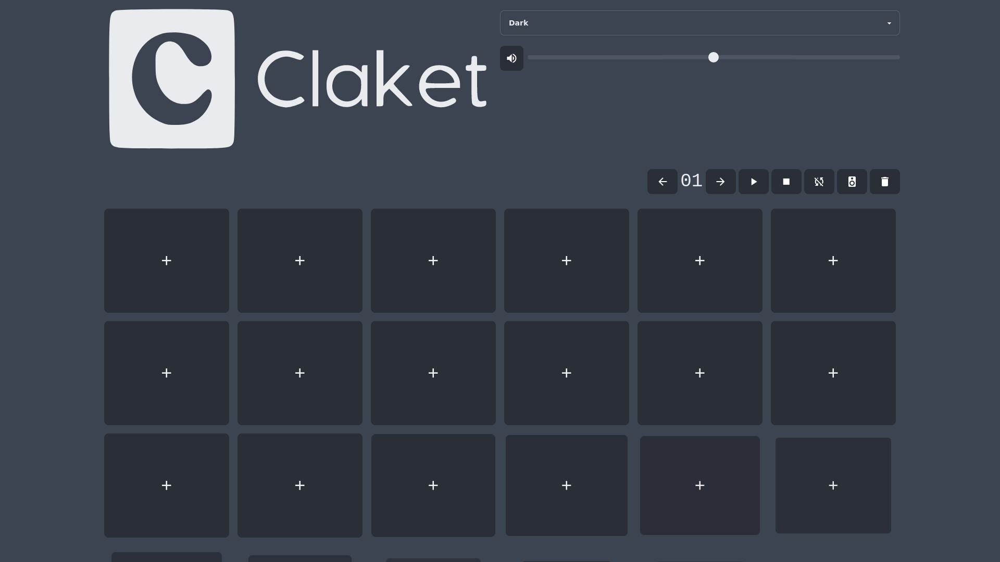

<br/>
<p align="center">
  <a href="https://github.com/aera128/aera128/claket">
    
  </a>

  <h3 align="center">Claket Soundboard</h3>

  <p align="center">
    Simple PWA soundboard made with Nuxt.js
    <br/>
    <br/>
    <a href="https://github.com/aera128/aera128/claket/issues">Report Bug</a>
    .
    <a href="https://github.com/aera128/aera128/claket/issues">Request Feature</a>
  </p>
</p>

 

## About The Project



Claket is a simple PWA soundboard made with Nuxt.js and use IndexedDB API.

## Getting Started


### Installation

```bash
# install dependencies
$ yarn install

# serve with hot reload at localhost:3000
$ yarn dev

# build for production and launch server
$ yarn build
$ yarn start

# generate static project
$ yarn generate
```

## License

Distributed under the MIT License. See [LICENSE](https://github.com/aera128/aera128/claket/LICENSE) for more information.

## Authors

**aera128** - *Fullstack Web Developer* - [aera128](https://github.com/aera128/)
